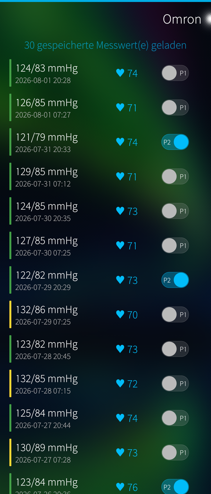
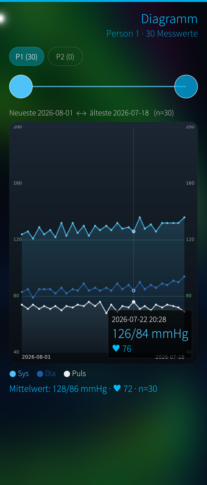
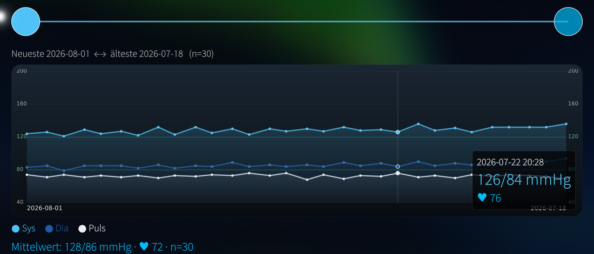

# somble

A native, **unofficial** Sailfish OS app that downloads the stored measurements
from an **Omron** blood-pressure monitor over **Bluetooth LE**, charts them, and
exports them.

It talks to **BlueZ directly over D-Bus** (`org.bluez`, GATT) rather than through
QtBluetooth — the Sailfish build target ships only the QtConnectivity runtime
library, not its development headers, so there is nothing to build against.
Qt5DBus is all this needs.

<p>

&nbsp;

</p>

<p>

</p>

*(Screenshots show generated sample data, and a German system language — the
app ships English and German.)*

## What works

* **Download over Bluetooth LE** — reads the monitor's whole 100-slot ring
  buffer in one session.
* **Growing archive** — the monitor only keeps 100 readings; each download is
  merged into a persistent local archive, so it can accumulate far past that.
  Save/load named archive files to back up or combine series.
* **Chart** — systolic / diastolic / pulse over time, reached by swiping left.
  Two-handle range slider, tappable points with a detail read-out, and an
  “optimum” band around 120/80. Mirrored time axis (newest on the left).
* **Two people** — the monitor has a single memory and records no user, so each
  reading carries a P1/P2 switch you set yourself. The assignment is stored in
  the archive and survives further downloads; the chart shows one person at a
  time.
* **Device page** — manufacturer, model, serial, hardware/firmware/software
  revision, battery level, Bluetooth address and negotiated MTU, plus the
  monitor's own clock.
* **Clock** — set the monitor's clock; see the caveat below.
* **Deleting** — remove a single reading or all of them. Deletions are
  remembered, so a later download does not resurrect them.
* **Exports** — CSV, and the chart as an image (JPG).
* **English and German** — the German translation is installed automatically
  when the system language is German.
* A plausibility filter drops implausible records so averages stay clean.

Each action does exactly one thing: pairing only pairs, setting the clock only
sets the clock, downloading only downloads. That matters because the monitor
powers itself off shortly after every transfer.

## Requirements

* Sailfish OS (aarch64; developed/tested on 5.x).
* An Omron monitor speaking the vendor GATT service
  `ecbe3980-c9a2-11e1-b1bd-0002a5d5c51b`. Developed against an **EVOLV
  (HEM-7600T)**; the record layout and memory map are that model's.
* The monitor bonded once through Settings → Bluetooth. The app cannot do this
  itself — Sailfish does not let an ordinary application call BlueZ's
  `Adapter1.RemoveDevice`, `AgentManager1.RegisterAgent` or `Device1.Pair`.

## Using it

### Once, before anything else

1. **Bond the monitor in Settings → Bluetooth.** This step is unavoidable and
   cannot be done from somble: Sailfish does not let an ordinary application
   drive BlueZ pairing (see *Requirements*). Put the monitor into pairing mode
   first — switch it off, then hold its connect button until the display shows
   a blinking “P” — and pair it like any other Bluetooth device.
2. In somble, pull down → **Pair with monitor**, with the monitor still in
   pairing mode. This stores somble's own 16-byte key in the monitor (see
   below) and nothing else. The Bluetooth link is left open afterwards, so the
   next step needs no further button press.
3. **Device → Set the monitor's clock.** Do this before your first real
   measurement — see the section below for why.

### Every time

4. Press the monitor's connect button so it starts advertising, then pull down
   → **Download from device**. Repeat over time; the archive grows.
5. Swipe left for the chart; drag the range-slider handles to pick a window.

Steps 1–3 are needed again after a factory reset (“Clr”) on the monitor, which
erases both the pairing key and the clock.

### The pairing key

The monitor stores exactly **one** 16-byte key and only talks to whoever
presents it. Pairing writes somble's key into the monitor, which **replaces the
key any other app had stored there** — that app will need to pair again.

The key is editable under **Raw data / pairing key**, so a key another tool
already programmed can be entered instead of overwriting it.

### Set the clock before your first measurement

**The monitor ships with its clock unset** — the unit this was developed against
reports **2015-01-01 00:00:00** out of the box, and a factory reset (“Clr”)
returns it to exactly that. The monitor stamps every reading from that clock,
and the timestamp is stored inside the record, so it can never be corrected
afterwards.

So before taking any measurement you care about, pair the monitor and run
**Device → Set the monitor's clock**. It takes about a second.

Readings taken while the clock was unset all carry the same meaningless
timestamp. somble shows them as *“no date”* and leaves them out of the chart,
rather than plotting them on a fictitious date — but their time is lost for
good.

As a safety net a download also sets the clock automatically **if it finds it
unset**, within the same session — the monitor powers off far too quickly to
start a second one. That still only helps the readings taken afterwards.

Writing the clock is the **only** thing somble ever writes to the monitor's
memory. In particular it never resets the monitor's unread-record counter: it
does not need to (every download reads the full ring buffer), and that counter
lives in the same memory region as what is believed to be the pressure-sensor
calibration data.

Note that a factory reset (“Clr”) on the monitor clears the clock and the
pairing key but, at least on the unit tested here, leaves the stored
measurements intact.

## Sandboxing

The app ships `Sandboxing=Disabled` in its `.desktop`. Sailjail's stock
`Bluetooth` permission is not sufficient: it passes through only broadcasts
whose interface is `org.bluez.*`, while the signals this app depends on —
`org.freedesktop.DBus.Properties.PropertiesChanged` (characteristic values,
`ServicesResolved`) and `org.freedesktop.DBus.ObjectManager.InterfacesAdded`
(device discovery) — are standard D-Bus interfaces and get filtered out.

Note that *omitting* the `[X-Sailjail]` section does not mean “unsandboxed”:
apps started through `invoker` then get the default profile and are jailed
anyway.

## Building

With the Sailfish SDK (Platform SDK / `mb2`):

```sh
mb2 -t SailfishOS-<version>-aarch64 build
```

Install the resulting RPM with `devel-su pkcon install-local <rpm>`.

## Troubleshooting

The app writes a trace of the whole Bluetooth session to
`~/.local/share/harbour-somble/harbour-somble/somble.log`, truncated on every
start. It records the device match, each connection attempt and its result, and
every protocol packet in both directions.

The monitor advertises only for a short while after its connect button is
pressed, and powers off a couple of minutes later. “Monitor not found” almost
always means it is asleep rather than that anything is misconfigured.

## Status & responsible use

**Proof of concept / work in progress.** This is a hobby project, shared **as is**
with **no warranty** of any kind (see the GPLv3). It may be incomplete, rough
around the edges, or change without notice — use it at your own risk.

**This is not a medical device and displays no medically validated data.** It
only reads back what the monitor already stored and shows it; the readings, and
any conclusion drawn from them, are your own responsibility. Never use it to
diagnose, to judge a course of treatment, or to adjust medication. Only a doctor
is qualified to do that.

The protocol was reconstructed from community reverse-engineering, not from
vendor documentation. Decoding errors are possible, and the only write it
performs — setting the monitor's clock — touches the same memory region that is
believed to hold the pressure-sensor calibration data. That write is optional
and confirmed, but it is your monitor and your risk.

somble is not affiliated with, endorsed by, or supported by Omron.

## Attribution & licence

The wire protocol was reconstructed from community reverse-engineering — see
[ATTRIBUTION.md](ATTRIBUTION.md). Licensed **GPL-3.0-or-later**
([LICENSE](LICENSE)).
